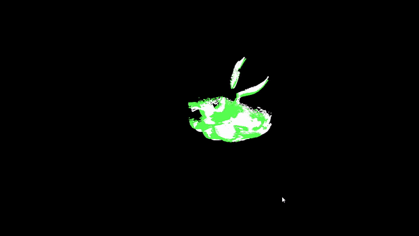
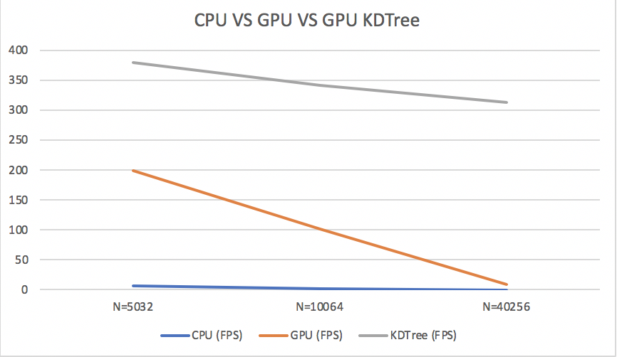

**University of Pennsylvania, CIS 565: GPU Programming and Architecture, Project6-Point-Cloud-Registration**
Point Cloud Registration with CUDA to Substitute Original Vulkan Project 

* Yu Sun
* [LinkedIn](https://www.linkedin.com/in/yusun3/)
* Tested on: Windows 10 , i7-6700HQ CPU @ 2.60GHz × 8 , GeForce GTX 960M/PCIe/SSE2, 7.7GB Memory (Personal Laptop)

## Introduction

Below is a demo run of the registration of point cloud. The source point cloud was shifted certain distance and rotated certain angle away from the original point cloud. The algorithm was able to register these two point clouds together. 

The main algorithm behind the registration is Iterative Closest Point (ICP), which is a commonly known algorithm used to reconstruct point clouds from different scans. It is widely used in localization and path planning. People also do point cloud registration based on feature descriptor matching and transformation (where you have more information like color). However, for this project, that is way too complicate for me to implement so I'll possibly leave that to the final project. There are also many variants of ICP, such as how you sample the points, what distance measurement you use, do you perform outlier rejection or do you use K Nearest Neighbor or Nearest Neighbor to estimate the surface, etc. Here I just followed the algorithm described in this [link](http://ais.informatik.uni-freiburg.de/teaching/ss11/robotics/slides/17-icp.pdf) with the following idea:

* We can know the correct correspondance by iterative approach
* Substrct center of mass from every corresponding points in the set
* Use SVD to find the rotation and translation matrix between the two datasets
* Converges if the starting positions are close enough

With fixed algorithm, I compared the performance using three different methods to see how much speed up we can get by leveraging the use of GPU. I implemented an exhaustive search version with cpu, a version exhaustive search version with GPU, and a KDTree based search with GPU. The performance analysis can be seen below.

## Performance Analysis (Number of Points)
Here are how these three approach perform for scenes with different number of pts. To show this more explicitly, the exact numbers are also shown.

Graph    | Exact Number
:-------------------------:|:-------------------------:
  |   

The performance gain of using GPU is huge since exhaustive search is an O(n^2) process, and the process can be parallized very easily. Also KDTree is much faster because the tree structure reduces the number of searches needed to be done. Building the tree takes O(nlogn) with mean. However, this is a one time process, and the tree built can be used in many iterations in the algorithm.

I also analysize the performance of this algorithm with and without display. The result are shown below:

This make senses since copying the pts color to VBO becomes a bottle neck and thus it takes around the same time even with different number of points in the scene. 

## Issue

I tried a long time debugging for KDTree since I originally thought that KDTree should always give the exact result as exhaustive search, but due to some reason, it seems like when there are competition between distance, the tree is not able to handle it properly (non optimal closet point) so the result is not ideal as the exhaustive search. I guess that's why people also use correspondence rejection or use K Nearest Neigbhor, but I don't have the time to implement such algorithm given I only had 4 days for this project. 

## Citation

I used some of the previous project's code for loading and displaying point clouds, don't have time to figure out the PCL yet. Leave it to the final project. 
I also used open source code for svd calculation. (https://github.com/ericjang/svd3)

